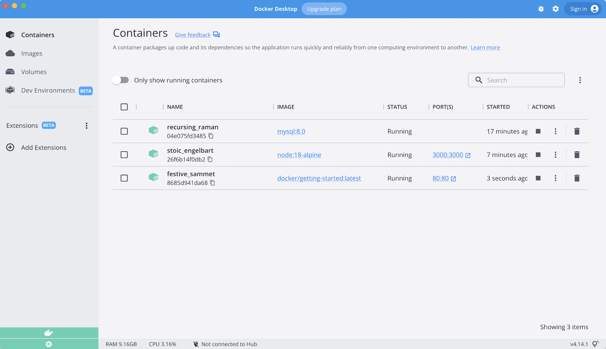

Hasta este momento, hemos estado trabajando con aplicaciones de contenedor único. Pero ahora queremos 
agregar MySQL al stack de aplicaciones. A menudo surge la siguiente pregunta: "¿Dónde se ejecutará MySQL? 
¿Instalarlo en el mismo contenedor o ejecutarlo por separado?" En general, **cada contenedor debe hacer 
una cosa y hacerlo bien.** Algunas razones:

- Existe una gran posibilidad de que tenga que escalar las API y los front-ends de manera diferente 
  a las bases de datos
- Los contenedores separados le permiten versionar y actualizar versiones de forma aislada
- Si bien puede usar un contenedor para la base de datos localmente, es posible que desee usar un 
  servicio administrado para la base de datos en producción. Entonces no desea enviar su motor de 
  base de datos con su aplicación.
- La ejecución de varios procesos requerirá un administrador de procesos (el contenedor solo inicia 
  un proceso), lo que agrega complejidad al inicio del contenedor

Y hay más razones. Entonces, actualizaremos nuestra aplicación para que funcione así:


{: .text-center }


## Redes de contenedores

Recuerde que los contenedores, por defecto, se ejecutan de forma aislada y no saben nada sobre otros 
procesos o contenedores en la misma máquina. Entonces, ¿cómo permitimos que un contenedor hable con 
otro? La respuesta es la **creación de redes**. Ahora, no tiene que ser un ingeniero de redes (¡hurra!). 
Simplemente recuerda esta regla ...

> Si dos contenedores están en la misma red, pueden comunicarse entre sí. Si no lo están, no pueden.


## Iniciando MySQL

Hay dos formas de poner un contenedor en una red: 1) Asignarlo al inicio o 2) Conectar un contenedor existente.
Por ahora, crearemos la red primero y adjuntaremos el contenedor MySQL al inicio.

1. Crea la red.

    ```bash
    docker network create todo-app
    ```

1. Inicie un contenedor MySQL y conéctelo a la red. También vamos a definir algunas variables de entorno que la base de 
   datos utilizará para inicializar la base de datos. (consulte la sección "Environment Variables" en la [MySQL Docker Hub listing](https://hub.docker.com/_/mysql/)).

    ```bash
    docker run -d \
        --network todo-app --network-alias mysql \
        -v todo-mysql-data:/var/lib/mysql \
        -e MYSQL_ROOT_PASSWORD=secret \
        -e MYSQL_DATABASE=todos \
        mysql:5.7
    ```

    Si está utilizando PowerShell, utilice este comando.

    ```powershell
    docker run -d `
        --network todo-app --network-alias mysql `
        -v todo-mysql-data:/var/lib/mysql `
        -e MYSQL_ROOT_PASSWORD=secret `
        -e MYSQL_DATABASE=todos `
        mysql:5.7
    ```

    También verá que especificamos la bandera `--network-alias`. Volveremos a eso en un momento.

    !!! info "Pro-tip"
        Notarás que estamos usando un volume named `todo-mysql-data` aquí y lo estamos montando en `/var/lib/mysql`, 
        que es donde MySQL almacena sus datos. Sin emabargo, nunca ejecutamos un comando `docker volume create`. 
        Docker reconoce que queremos usar un volume named y crea uno automáticamente para nosotros.

1. Para confirmar que tenemos la base de datos en funcionamiento, conéctese a la base de datos y verifique que se conecte.

    ```bash
    docker exec -it <mysql-container-id> mysql -p
    ```

   Cuando aparezca la solicitud de contraseña, escriba **secret**. En el shell de MySQL, enumere las bases 
   de datos y verifique que vea la base de datos `todos`.

    ```cli
    mysql> SHOW DATABASES;
    ```

    Debería ver una salida que se ve así:

    ```plaintext
    +--------------------+
    | Database           |
    +--------------------+
    | information_schema |
    | mysql              |
    | performance_schema |
    | sys                |
    | todos              |
    +--------------------+
    5 rows in set (0.00 sec)
    ```

    ¡Hurra! ¡Tenemos nuestra base de datos `todos` y está lista para que la usemos!


## Conectarse a MySQL

Ahora que sabemos que MySQL está funcionando, usémoslo! ¿Pero la pregunta es cómo? Si ejecutamos 
otro contenedor en la misma red, ¿cómo encontramos el contenedor (recuerde que cada contenedor 
tiene su propia dirección IP)?

Para resolverlo, usaremos el [nicolaka/netshoot](https://github.com/nicolaka/netshoot) contenedor, 
que se envía con _muchas_ herramientas que son útiles para solucionar problemas o depurar problemas de red.

1. Inicie un nuevo contenedor con la imagen de nicolaka/netshoot. Asegúrate de conectarlo a la misma red.

    ```bash
    docker run -it --network todo-app nicolaka/netshoot
    ```

1. Dentro del contenedor, usaremos el comando `dig`, que es una útil herramienta de DNS. 
   Vamos a buscar la dirección IP del nombre de host `mysql`.

    ```bash
    dig mysql
    ```

    Y obtendrás un resultado como este ...

    ```text
    ; <<>> DiG 9.14.1 <<>> mysql
    ;; global options: +cmd
    ;; Got answer:
    ;; ->>HEADER<<- opcode: QUERY, status: NOERROR, id: 32162
    ;; flags: qr rd ra; QUERY: 1, ANSWER: 1, AUTHORITY: 0, ADDITIONAL: 0

    ;; QUESTION SECTION:
    ;mysql.				IN	A

    ;; ANSWER SECTION:
    mysql.			600	IN	A	172.23.0.2

    ;; Query time: 0 msec
    ;; SERVER: 127.0.0.11#53(127.0.0.11)
    ;; WHEN: Tue Oct 01 23:47:24 UTC 2019
    ;; MSG SIZE  rcvd: 44
    ```

    En la "ANSWER SECTION", verá un registro `A` para` mysql` que se resuelve en `172.23.0.2` 
    (lo más probable es que su dirección IP tenga un valor diferente). Si bien `mysql` no es normalmente un nombre de 
    host válido, Docker pudo resolverlo en la dirección IP del contenedor que tenía ese alias de red (¿recuerda el 
    indicador` --network-alias` que usamos anteriormente?).
    
    Lo que esto significa es que... nuestra aplicación solo necesita conectarse a un host llamado `mysql` y se 
    comunicará con la base de datos. ¡No hay nada más simple que eso!


## Ejecutando nuestra aplicación con MySQL

La aplicación **todo** admite la configuración de algunas variables de entorno para especificar la configuración de la 
conexión MySQL. Ellos son:

- `MYSQL_HOST` - el nombre de host del servidor MySQL en ejecución
- `MYSQL_USER` - el nombre de usuario que se utilizará para la conexión
- `MYSQL_PASSWORD` - la contraseña que se utilizará para la conexión
- `MYSQL_DB` - la base de datos para usar una vez conectado

!!! warning Establecer la configuración de conexión a través de Env Vars
    Si bien el uso de env vars para establecer la configuración de conexión generalmente está bien para el desarrollo, 
    Es **MUY DESALENTADOR** cuando se ejecutan aplicaciones en producción. Diogo Monica, el ex líder de seguridad en Docker, 
    [wrote a fantastic blog post](https://diogomonica.com/2017/03/27/why-you-shouldnt-use-env-variables-for-secret-data/) 
    explicando por qué. 
    
    Un mecanismo más seguro es utilizar el soporte secreto proporcionado por su marco de orquestación de contenedores. 
    En la mayoría de los casos, estos secrets se montan como archivos en el contenedor en ejecución. Verá muchas 
    aplicaciones (incluida la imagen MySQL y la aplicación de tareas pendientes) que también admiten vars env con un 
    sufijo `_FILE` para señalar un archivo que contiene la variable. 
    
    Como ejemplo, la configuración de la var `MYSQL_PASSWORD_FILE` hará que la aplicación use el contenido del archivo 
    referenciado como contraseña de conexión. Docker no hace nada para admitir estas variables de entorno. Su aplicación 
    necesitará saber para buscar la variable y obtener el contenido del archivo.


Con todo eso explicado, ¡comencemos nuestro contenedor listo para desarrolladores!

1. Especificaremos cada una de las variables de entorno anteriores, además de conectar el contenedor a nuestra red de 
   aplicaciones.

    ```bash hl_lines="3 4 5 6 7"
    docker run -dp 3000:3000 \
      -w /app -v "$(pwd):/app" \
      --network todo-app \
      -e MYSQL_HOST=mysql \
      -e MYSQL_USER=root \
      -e MYSQL_PASSWORD=secret \
      -e MYSQL_DB=todos \
      node:12-alpine \
      sh -c "yarn install && yarn run dev"
    ```

    Si está utilizando PowerShell, utilice este comando.

    ```powershell hl_lines="3 4 5 6 7"
    docker run -dp 3000:3000 `
      -w /app -v "$(pwd):/app" `
      --network todo-app `
      -e MYSQL_HOST=mysql `
      -e MYSQL_USER=root `
      -e MYSQL_PASSWORD=secret `
      -e MYSQL_DB=todos `
      node:12-alpine `
      sh -c "yarn install && yarn run dev"
    ```

1. Si miramos los registros del contenedor (`docker logs <container-id>`), deberíamos ver un mensaje que indica que está 
   usando la base de datos mysql.

    ```plaintext hl_lines="7"
    # Previous log messages omitted
    $ nodemon src/index.js
    [nodemon] 1.19.2
    [nodemon] to restart at any time, enter `rs`
    [nodemon] watching dir(s): *.*
    [nodemon] starting `node src/index.js`
    Connected to mysql db at host mysql
    Listening on port 3000
    ```

1. Abra la aplicación en su navegador y agregue algunos elementos a su lista de tareas pendientes.

1. Conéctese a la base de datos mysql y demuestre que los elementos se escriben en la base de datos. Recuerde, la 
   contraseña es **secreta**.

    ```bash
    docker exec -it <mysql-container-id> mysql -p todos
    ```

    Y en el shell de mysql, ejecute lo siguiente:

    ```plaintext
    mysql> select * from todo_items;
    +--------------------------------------+--------------------+-----------+
    | id                                   | name               | completed |
    +--------------------------------------+--------------------+-----------+
    | c906ff08-60e6-44e6-8f49-ed56a0853e85 | Do amazing things! |         0 |
    | 2912a79e-8486-4bc3-a4c5-460793a575ab | Be awesome!        |         0 |
    +--------------------------------------+--------------------+-----------+
    ```

    Obviamente, tu tabla se verá diferente porque tiene tus artículos. ¡Pero deberías verlos almacenados allí!

Si echas un vistazo rápido al panel de Docker, verás que tenemos dos contenedores de aplicaciones ejecutándose. Pero no 
hay indicios reales de que estén agrupados en una sola aplicación. ¡Veremos cómo mejorarlo en breve!



## Resumen

En este punto, tenemos una aplicación que ahora almacena sus datos en una base de datos externa que se ejecuta en un 
contenedor separado. Aprendimos un poco sobre redes de contenedores y vimos cómo se puede realizar el descubrimiento de 
servicios utilizando DNS.

Pero es muy probable que empiece a sentirse un poco abrumado con todo lo que necesita hacer para iniciar esta aplicación. 
¡Tenemos que crear una red, iniciar contenedores, especificar todas las variables de entorno, exponer puertos y más! 
Eso es mucho para recordar y ciertamente hace que las cosas sean más difíciles de transmitir a otra persona.

En la siguiente sección, hablaremos sobre Docker Compose. Con Docker Compose, podemos compartir nuestras pilas de 
aplicaciones de una manera mucho más fácil y dejar que otros las giren con un solo (y simple) comando.
