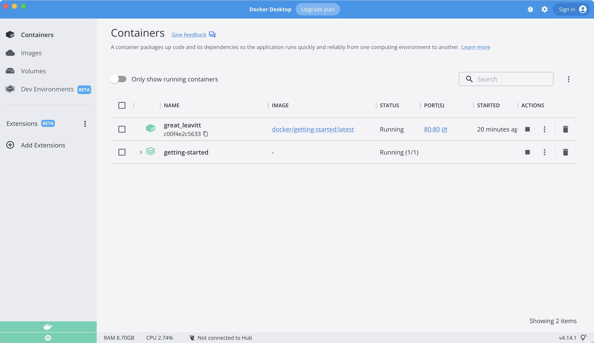

Para el resto de este tutorial, trabajaremos con un administrador de 
lista de tareas simple que se ejecuta en Node.js. Si no está familiarizado 
con Node.js, ¡no se preocupe! ¡No se necesita experiencia real en JavaScript!

En este punto, su equipo de desarrollo es bastante pequeño y simplemente 
está creando una aplicación para probar su PMV (producto mínimo viable). 
Desea mostrar cómo funciona y qué es capaz de hacer sin necesidad de pensar 
en cómo funcionará para un equipo grande, múltiples desarrolladores, etc.

{: style="width:50%;" }
{ .text-center }

## Obteniendo nuestra aplicación

Antes de que podamos ejecutar la aplicación, necesitamos obtener el código fuente 
de la aplicación en nuestra máquina. Para proyectos reales, normalmente clonarás el 
repositorio. Pero, para este tutorial, hemos creado un archivo ZIP que contiene la aplicación.

1. [Descarga el ZIP](/assets/app.zip). Abra el archivo ZIP y asegúrese de extraer el contenido.

1. Una vez extraído, usa tu editor de código favorito para abrir el proyecto. Si necesitas un
    editor, puedes usar [Visual Studio Code](https://code.visualstudio.com/). Debería ver el
    `package.json` y dos subdirectorios (`src` y `spec`).

    {: style="width:650px;margin-top:20px;"}
    {: .text-center }

## Creación de la imagen del contenedor de la aplicación

Para construir la aplicación, necesitamos usar un `Dockerfile`. Un 
dockerfile es simplemente un script de instrucciones basado en 
texto que se usa para crear una imagen de contenedor. Si ha creado 
Dockerfiles antes, es posible que vea algunas fallas en el Dockerfile 
a continuación. ¡Pero no te preocupes! Los repasaremos.

1. Cree un archivo llamado `Dockerfile` en la misma carpeta que el archivo `package.json` con el siguiente contenido.

    ```dockerfile
    FROM node:12-alpine
    RUN apk add --no-cache python g++ make
    WORKDIR /app
    COPY . .
    RUN yarn install --production
    CMD ["node", "src/index.js"]
    ```

    Compruebe que el archivo `Dockerfile` no tenga una extensión de archivo como `.txt`. Algunos editores pueden agregar esta extensión de archivo automáticamente y esto daría como resultado un error en el siguiente paso.

1. Si aún no lo ha hecho, abra una terminal y vaya al directorio `app` con el `Dockerfile`. Ahora construya la imagen del contenedor usando el comando `docker build`.

    ```bash
    docker build -t getting-started .
    ```

    Este comando usó el Dockerfile para crear una nueva imagen de contenedor. Es posible 
    que haya notado que se descargaron muchas "capas". Esto se debe a que le indicamos 
    al constructor que queríamos comenzar desde la imagen `node: 12-alpine`. Pero, como 
    no teníamos eso en nuestra máquina, era necesario descargar esa imagen.

    Después de descargar la imagen, copiamos en su aplicación y usamos `yarn` para instalar
    las dependencias de su aplicación. La directiva `CMD` especifica el comando predeterminado 
    que se ejecutará al iniciar un contenedor desde esta imagen.

    Finalmente, la bandera `-t` etiqueta nuestra imagen. Piense en esto simplemente como un nombre 
    legible por humanos para la imagen final. Dado que llamamos a la imagen `getting-started`, 
    podemos hacer referencia a esa imagen cuando ejecutamos un contenedor.

    El `.` al final del comando `docker build` indica que Docker debe buscar el `Dockerfile` en el directorio actual.

## Iniciar un contenedor de aplicaciones

Ahora que tenemos una imagen, ¡ejecutemos la aplicación! Para hacerlo, usaremos el 
comando `docker run` (¿recuerdas eso de antes?).

1. Inicie su contenedor usando el comando `docker run` y especifique el nombre de la imagen que acabamos 
    de crear:

    ```bash
    docker run -dp 3000:3000 getting-started
    ```

    ¿Recuerda las banderas `-d` y `-p`? Estamos ejecutando el nuevo contenedor en modo "separado" (en 
    segundo plano) y creando un mapeo entre el puerto 3000 del host y el puerto 3000 del contenedor.
    Sin el mapeo de puertos, no podríamos acceder a la aplicación.

1. Después de unos segundos, abra su navegador web a [http://localhost:3000](http://localhost:3000).
    ¡Deberías ver nuestra aplicación!

    {: style="width:450px;margin-top:20px;"}
    {: .text-center }

1. Continúe y agregue uno o dos elementos y compruebe que funcionan como espera. Puede marcar elementos
   como completos y eliminar elementos. ¡Tu interfaz está almacenando elementos con éxito en el backend!
   Bastante rápido y fácil, ¿eh?


En este punto, debería tener un administrador de lista de tareas en ejecución con algunos elementos,
¡todos creados por usted! Ahora, hagamos algunos cambios y aprendamos a administrar nuestros contenedores.

Si echa un vistazo rápido al panel de Docker, debería ver sus dos contenedores ejecutándose ahora 
(este tutorial y su contenedor de aplicaciones recién lanzado).




## Resumen

En esta breve sección, aprendimos los conceptos básicos sobre cómo crear una imagen de contenedor
y crear un Dockerfile. Una vez que creamos una imagen, iniciamos el contenedor y vimos la aplicación
en ejecución.

A continuación, haremos una modificación en nuestra aplicación y aprenderemos cómo actualizar nuestra
aplicación en ejecución con una nueva imagen. En el camino, aprenderemos algunos otros comandos útiles.