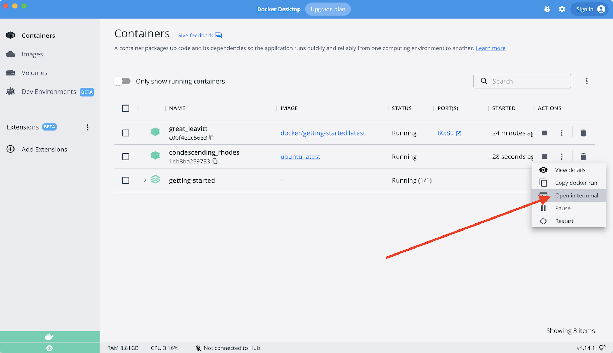

En caso de que no se haya dado cuenta, nuestra lista de tareas pendientes se borra cada vez 
que lancemos el contenedor. ¿Por qué es esto? Veamos cómo está funcionando el contenedor.

## El sistema de archivos del contenedor

Cuando se ejecuta un contenedor, utiliza las distintas capas de una imagen para su sistema de archivos. 
Cada contenedor también tiene su propio "espacio temporal" para crear/actualizar/eliminar archivos.
Los cambios no se verán en otro contenedor, _incluso si_ están usando la misma imagen.

### Viendo esto en la práctica

Para ver esto en acción, vamos a iniciar dos contenedores y crear un archivo en cada uno.
Lo que verá es que los archivos creados en un contenedor no están disponibles en otro.

1. Inicie un contenedor `ubuntu` que creará un archivo llamado `/data.txt` con un número 
   aleatorio entre 1 y 10000.

    ```bash
    docker run -d ubuntu bash -c "shuf -i 1-10000 -n 1 -o /data.txt && tail -f /dev/null"
    ```

    En caso de que sienta curiosidad por el comando, estamos iniciando un shell bash e invocando 
    dos comandos (porque tenemos `&&`). La primera parte elige un solo número aleatorio y lo 
    escribe en `/data.txt`. El segundo comando es simplemente mirar un archivo para mantener el 
    contenedor en ejecución.

1. Validamos que podemos ver la salida ejecutando `exec` en el contenedor. Para hacerlo, abra el Panel de control y haga clic en la primera acción del contenedor que ejecuta la imagen de `ubuntu`.

    {: style=width:75% }
{: .text-center }

    Verá una terminal que está ejecutando un shell en el contenedor de ubuntu. Ejecute el siguiente comando para ver el contenido del archivo `/data.txt`. Cierra esta terminal luego nuevamente.

    ```bash
    cat /data.txt
    ```

    Si prefiere la línea de comandos, puede usar el comando `docker exec` para hacer lo mismo. Necesita obtener el ID 
   del contenedor (use `docker ps` para obtenerlo) y obtener el contenido con el siguiente comando.

    ```bash
    docker exec <container-id> cat /data.txt
    ```

    ¡Debería ver un número aleatorio!

1. Ahora, comencemos otro contenedor `ubuntu` (la misma imagen) y veremos que no tenemos el mismo archivo.

    ```bash
    docker run -it ubuntu ls /
    ```

    ¡Y mira! ¡No hay ningún archivo `data.txt` allí! Eso es porque se escribió en el espacio temporal solo 
    para el primer contenedor.

1. Continúe y elimine el primer contenedor usando el comando `docker rm -f`.

## Volúmenes de contenedores

Con el experimento anterior, vimos que cada contenedor comienza desde la definición de la imagen cada vez 
que comienza. Si bien los contenedores pueden crear, actualizar y eliminar archivos, esos cambios se pierden 
cuando se elimina el contenedor y todos los cambios se aíslan en ese contenedor. Con los volúmenes, podemos 
cambiar todo esto.

[Volumes](https://docs.docker.com/storage/volumes/) brindan la capacidad de conectar rutas específicas del 
sistema de archivos del contenedor a la máquina host. Si se monta un directorio en el contenedor, los cambios 
en ese directorio también se ven en la máquina host. Si montamos ese mismo directorio en los reinicios del 
contenedor, veríamos los mismos archivos.

Hay dos tipos principales de volúmenes. Eventualmente usaremos ambos, pero comenzaremos con **volúmenes con nombre**.

## Persistiendo nuestra Todo Data

De forma predeterminada, la aplicación de tareas pendientes almacena sus datos en una
[SQLite Database](https://www.sqlite.org/index.html) en `/etc/todos/todo.db`.
Si no está familiarizado con SQLite, ¡no se preocupe! Es simplemente una base de datos relacional 
en la que todos los datos se almacenan en un solo archivo. Si bien esto no es lo mejor para aplicaciones 
a gran escala, funciona para demostraciones pequeñas. Hablaremos de cambiar esto a un motor de base de 
datos diferente más adelante.

Dado que la base de datos es un solo archivo, si podemos conservar ese archivo en el host y ponerlo a 
disposición del siguiente contenedor, debería poder continuar donde lo dejó el último. Al crear un 
volumen y adjuntarlo (a menudo llamado "montar") al directorio en el que se almacenan los datos, 
podemos conservar los datos. A medida que nuestro contenedor escribe en el archivo `todo.db`, se 
mantendrá en el host en el volumen.

Como se mencionó, usaremos un **volumen con nombre**. Piense en un volumen con nombre como simplemente 
un depósito de datos. Docker mantiene la ubicación física en el disco y solo necesita recordar el nombre 
del volumen. Cada vez que utilice el volumen, Docker se asegurará de que se proporcionen los datos correctos.

1. Cree un volumen usando el comando `docker volume create`.

    ```bash
    docker volume create todo-db
    ```

1. Detenga el contenedor de la aplicación **todo** una vez más desde el Dashboard (o con `docker rm -f <id>`), ya 
   que todavía se está ejecutando sin usar el volumen persistente.

1. Inicie el contenedor de la aplicación **todo**, pero agregue el indicador `-v` para especificar un montaje de 
   volumen. Usaremos el volumen nombrado y lo montaremos en `/etc/todos`, que capturará todos los archivos creados 
   en la ruta.

    ```bash
    docker run -dp 3000:3000 -v todo-db:/etc/todos getting-started
    ```

1. Una vez que se inicia el contenedor, abra la aplicación y agregue algunos elementos a su lista de **todo**.

    {: style="width: 55%; " }
    {: .text-center }

1. Retire el contenedor de la aplicación **todo**. Utilice el Dashboard o `docker ps` para obtener el ID y luego 
   `docker rm -f <id>` para eliminarlo.

1. Inicie un nuevo contenedor usando el mismo comando de arriba.

1. Abra la aplicación. ¡Debería ver sus artículos todavía en su lista!

1. Continúe y retire el contenedor cuando haya terminado de revisar su lista.

¡Hurra! ¡Ahora ha aprendido a conservar los datos!

!!! info "Pro-tip"
    Mientras que los named volumes y los bind mounts (de los que hablaremos en un minuto) son los dos 
    tipos principales de volúmenes admitidos por una instalación predeterminada del motor Docker, ¡hay 
    muchos complementos de controladores de volumen disponibles para admitir NFS, SFTP, NetApp y más! 
    Esto será especialmente importante una vez que comience a ejecutar contenedores en varios hosts en 
    un entorno agrupado con Swarm, Kubernetes, etc.

## Sumergiéndonos en nuestro volumen

Mucha gente pregunta con frecuencia "¿Dónde está Docker _realmente_ almacenando mis datos cuando utilizo 
un named volume?" Si quieres saberlo, puedes usar el comando `docker volume inspect`.

```bash
docker volume inspect todo-db
[
    {
        "CreatedAt": "2019-09-26T02:18:36Z",
        "Driver": "local",
        "Labels": {},
        "Mountpoint": "/var/lib/docker/volumes/todo-db/_data",
        "Name": "todo-db",
        "Options": {},
        "Scope": "local"
    }
]
```

El `Mountpoint` es la ubicación real en el disco donde se almacenan los datos. Tenga en cuenta que en la mayoría 
de las máquinas, deberá tener acceso de root para acceder a este directorio desde el host. ¡Pero ahí es donde está!

!!! info "Acceder a los datos de volumen directamente en Docker Desktop"
    Mientras se ejecuta en Docker Desktop, los comandos de Docker se ejecutan realmente dentro de una pequeña máquina 
    virtual en su máquina. Si desea ver el contenido real del directorio Mountpoint, primero debe ingresar a la VM.

## Resumen

En este punto, tenemos una aplicación en funcionamiento que puede sobrevivir a los reinicios. 
¡Podemos mostrárselo a nuestros inversores y esperamos que puedan captar nuestra visión!

Sin embargo, vimos anteriormente que la reconstrucción de imágenes para cada cambio lleva bastante tiempo. 
Tiene que haber una mejor manera de hacer cambios, ¿verdad? Con bind mounts (que insinuamos anteriormente), 
¡hay una mejor manera! ¡Echemos un vistazo a eso ahora!
