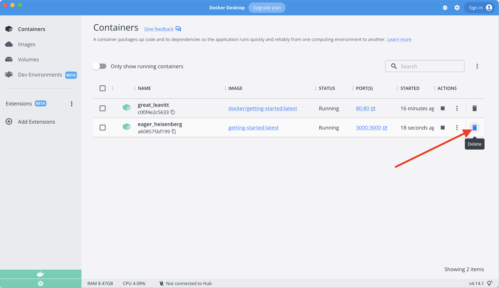

Como una pequeña solicitud de función, el equipo de producto nos ha pedido que cambiemos 
el "texto vacío" cuando no tenemos ningún elemento de la lista de tareas pendientes. Les 
gustaría hacer la transición a lo siguiente:

> You have no todo items yet! Add one above!

Bastante simple, ¿verdad? Hagamos el cambio.

## Actualización de nuestro código fuente

1. En el archivo `src/static/js/app.js`, actualice la línea 56 para usar el nuevo texto vacío.

    ```diff
    -                <p className="text-center">No items yet! Add one above!</p>
    +                <p className="text-center">You have no todo items yet! Add one above!</p>
    ```

1. Construyamos nuestra versión actualizada de la imagen, usando el mismo comando que usamos antes.

    ```bash
    docker build -t getting-started .
    ```

1. Comencemos un nuevo contenedor usando el código actualizado.

    ```bash
    docker run -dp 3000:3000 getting-started
    ```

**Uh oh!** Probablemente vio un error como este (las ID serán diferentes):

```bash
docker: Error response from daemon: driver failed programming external connectivity on endpoint laughing_burnell 
(bb242b2ca4d67eba76e79474fb36bb5125708ebdabd7f45c8eaf16caaabde9dd): Bind for 0.0.0.0:3000 failed: port is already allocated.
```

¿Entonces qué pasó? No podemos iniciar el nuevo contenedor porque nuestro contenedor anterior todavía se está 
ejecutando. La razón por la que esto es un problema es porque ese contenedor está usando el puerto 3000 del 
host y solo un proceso en la máquina (contenedores incluidos) puede escuchar un puerto específico. Para solucionar 
este problema, debemos quitar el contenedor antiguo.


## Reemplazo de nuestro contenedor viejo

Para quitar un contenedor, primero debe detenerse. Una vez que se haya detenido, se puede quitar. Tenemos dos 
formas de quitar el contenedor viejo. Siéntase libre de elegir el camino con el que se sienta más cómodo.


### Eliminar un contenedor usando la CLI

1. Obtenga el ID del contenedor usando el comando `docker ps`.

    ```bash
    docker ps
    ```

1. Utilice el comando `docker stop` para detener el contenedor.

    ```bash
    # Cambie <the-container-id> con el ID de docker ps
    docker stop <the-container-id>
    ```

1. Una vez que el contenedor se ha detenido, puede eliminarlo utilizando el comando `docker rm`.

    ```bash
    docker rm <the-container-id>
    ```

!!! info "Pro tip"
    Puede detener y eliminar un contenedor con un solo comando agregando el indicador "force" 
    al comando `docker rm`. Por ejemplo: `docker rm -f <the-container-id>`

### Eliminar un contenedor con el panel de Docker

Si abre el panel de Docker, puede eliminar un contenedor con dos clics. Sin duda, 
es mucho más fácil que tener que buscar el ID del contenedor y eliminarlo.

1. Con el tablero abierto, coloque el cursor sobre el contenedor de la aplicación y verá aparecer 
    una colección de botones de acción a la derecha.

1. Haga clic en el icono de la papelera para eliminar el contenedor.

1. Confirma la eliminación y listo.




### Iniciando nuestro contenedor de aplicaciones actualizado

1. Ahora, inicie su aplicación actualizada.

    ```bash
    docker run -dp 3000:3000 getting-started
    ```

1. Actualiza tu navegador a [http://localhost:3000](http://localhost:3000) ¡y debería ver su texto de ayuda actualizado!

{: style="width:55%" }
{: .text-center }


## Resumen

Si bien pudimos crear una actualización, es posible que haya notado dos cosas:

- ¡Todos los elementos existentes en nuestra lista de tareas pendientes se han ido! ¡Esa no es una muy buena aplicación!
Hablaremos de eso en breve.
- Hubo _muchos_ pasos involucrados para un cambio tan pequeño. En una próxima sección, hablaremos sobre cómo ver las 
actualizaciones de código sin necesidad de reconstruir e iniciar un nuevo contenedor cada vez que hagamos un cambio.

Antes de hablar de persistencia, veremos rápidamente cómo compartir estas imágenes con otros.
