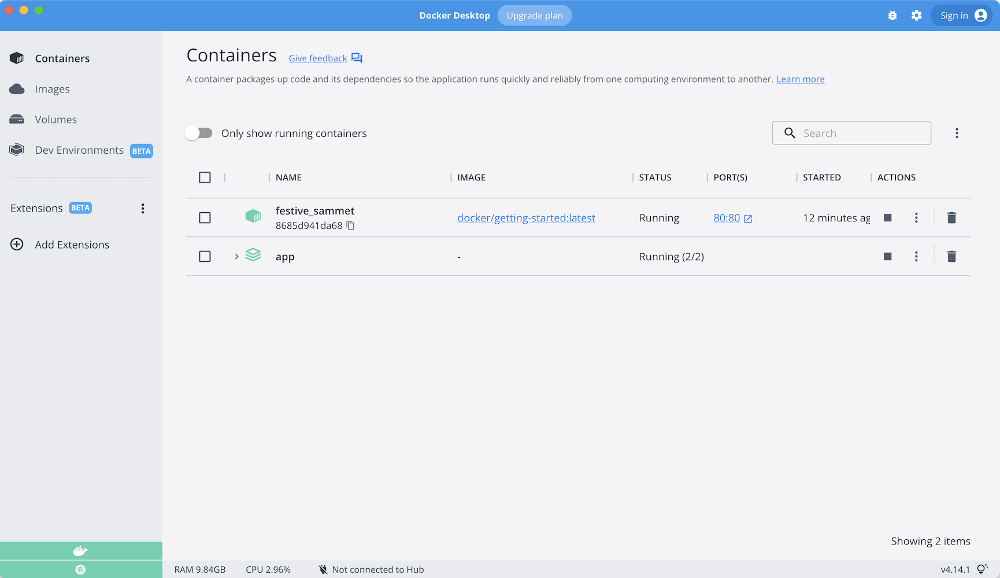
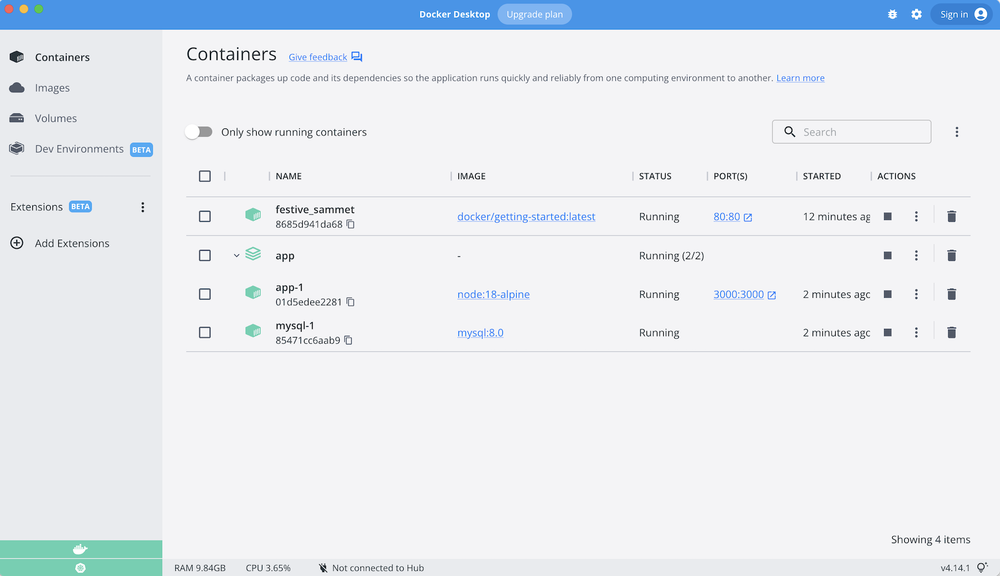

[Docker Compose](https://docs.docker.com/compose/) es una herramienta que se desarrolló para ayudar a definir y compartir 
aplicaciones de varios contenedores. Con Compose, podemos crear un archivo YAML para definir los servicios y con un solo 
comando, podemos hacer girar todo o destruirlo todo. 

La gran ventaja de usar Compose es que puede definir su pila de aplicaciones en un archivo, mantenerlo en la raíz del 
repositorio de su proyecto (ahora está controlado por la versión) y permitir fácilmente que otra persona contribuya a 
su proyecto. Alguien solo necesitaría clonar su repositorio e iniciar la aplicación de redacción. De hecho, es posible 
que veas bastantes proyectos en GitHubGitLab haciendo exactamente esto ahora.

Entonces, ¿cómo empezamos?

## Instalación de Docker Compose

Si instaló Docker DesktopToolbox para Windows o Mac, ¡ya tiene Docker Compose! Las instancias de Play-with-Docker 
también tienen Docker Compose instalado. Si está en una máquina Linux, deberá instalar Docker Compose usando
[las instrucciones aquí](https://docs.docker.com/compose/install/). 

Después de la instalación, debería poder ejecutar lo siguiente y ver la información de la versión.

```bash
docker-compose version
```


## Creando nuestro Compose File

1. En la raíz del proyecto de la aplicación, cree un archivo llamado `docker-compose.yml`.

1. En el archivo de redacción, comenzaremos definiendo la versión del esquema. En la mayoría de los casos, es mejor 
   utilizar la última versión compatible. Puede consultar la
   [Referencia a Compose file](https://docs.docker.com/compose/compose-file/) para ver las versiones actuales 
   del esquema y la matriz de compatibilidad.

    ```yaml
    version: "3.7"
    ```

1. A continuación, definiremos la lista de servicios (o contenedores) que queremos ejecutar como parte de nuestra aplicación.

    ```yaml hl_lines="3"
    version: "3.7"

    services:
    ```

Y ahora, comenzaremos a migrar un servicio a la vez en el compose file.


## Definición de la App Service

Para recordar, este era el comando que estábamos usando para definir nuestro contenedor de aplicaciones.

```bash
docker run -dp 3000:3000 \
  -w /app -v "$(pwd):/app" \
  --network todo-app \
  -e MYSQL_HOST=mysql \
  -e MYSQL_USER=root \
  -e MYSQL_PASSWORD=secret \
  -e MYSQL_DB=todos \
  node:12-alpine \
  sh -c "yarn install && yarn run dev"
```

Si está utilizando PowerShell, utilice este comando.

```powershell
docker run -dp 3000:3000 `
  -w /app -v "$(pwd):/app" `
  --network todo-app `
  -e MYSQL_HOST=mysql `
  -e MYSQL_USER=root `
  -e MYSQL_PASSWORD=secret `
  -e MYSQL_DB=todos `
  node:12-alpine `
  sh -c "yarn install && yarn run dev"
```

1. Primero, definamos la entrada de servicio y la imagen del contenedor. Podemos elegir cualquier nombre para el servicio. 
   El nombre se convertirá automáticamente en un alias de red, que será útil a la hora de definir nuestro servicio MySQL.

    ```yaml hl_lines="4 5"
    version: "3.7"

    services:
      app:
        image: node:12-alpine
    ```

1. Normalmente, verá el comando cerca de la definición de la `image`, aunque no hay ningún requisito para realizar el pedido.
   Entonces, sigamos adelante y traslademos eso a nuestro archivo.

    ```yaml hl_lines="6"
    version: "3.7"

    services:
      app:
        image: node:12-alpine
        command: sh -c "yarn install && yarn run dev"
    ```


1. Migremos la parte `-p 3000: 3000` del comando definiendo los `ports` para el servicio. 
   Usaremos la [sintaxis corta](https://docs.docker.com/compose/compose-file/#short-syntax-1) aquí, pero también hay una
   [sintaxis larga](https://docs.docker.com/compose/compose-file/#long-syntax-1) más detallada disponible también.

    ```yaml hl_lines="7 8"
    version: "3.7"

    services:
      app:
        image: node:12-alpine
        command: sh -c "yarn install && yarn run dev"
        ports:
          - 3000:3000
    ```

1. A continuación, migraremos tanto el directorio de trabajo (`-w app`) como el mapeo de volumen (`-v "$(pwd):/app"`)
   usando las definiciones `working_dir` y `volumes`. Los volúmenes también tienen una sintaxis [corta](https://docs.docker.com/compose/compose-file/#short-syntax-3) y [larga](https://docs.docker.com/compose/compose-file/#long-syntax-3).

    Una ventaja de las definiciones de volumen de Docker Compose es que podemos usar rutas relativas del directorio actual.

    ```yaml hl_lines="9 10 11"
    version: "3.7"

    services:
      app:
        image: node:12-alpine
        command: sh -c "yarn install && yarn run dev"
        ports:
          - 3000:3000
        working_dir: /app
        volumes:
          - ./:/app
    ```

1. Finalmente, necesitamos migrar las definiciones de variables de entorno usando la clave `environment`.

    ```yaml hl_lines="12 13 14 15 16"
    version: "3.7"

    services:
      app:
        image: node:12-alpine
        command: sh -c "yarn install && yarn run dev"
        ports:
          - 3000:3000
        working_dir: /app
        volumes:
          - ./:/app
        environment:
          MYSQL_HOST: mysql
          MYSQL_USER: root
          MYSQL_PASSWORD: secret
          MYSQL_DB: todos
    ```

  
### Definición del servicio MySQL

Ahora es el momento de definir el servicio MySQL. El comando que usamos para ese contenedor fue el siguiente:

```bash
docker run -d \
  --network todo-app --network-alias mysql \
  -v todo-mysql-data:/var/lib/mysql \
  -e MYSQL_ROOT_PASSWORD=secret \
  -e MYSQL_DATABASE=todos \
  mysql:5.7
```

Si está utilizando PowerShell, utilice este comando.

```powershell
docker run -d `
  --network todo-app --network-alias mysql `
  -v todo-mysql-data:/var/lib/mysql `
  -e MYSQL_ROOT_PASSWORD=secret `
  -e MYSQL_DATABASE=todos `
  mysql:5.7
```

1. Primero definiremos el nuevo servicio y lo llamaremos `mysql` para que automáticamente obtenga el alias de la red. 
   Continuaremos y especificaremos la imagen a usar también.

    ```yaml hl_lines="6 7"
    version: "3.7"

    services:
      app:
        # The app service definition
      mysql:
        image: mysql:5.7
    ```

1. A continuación, definiremos el mapeo de volumen. Cuando ejecutamos el contenedor con `docker run`, el named volume 
   se creó automáticamente. Sin embargo, eso no sucede cuando se ejecuta con Compose. Necesitamos definir el volumen 
   en la sección `volúmenes:` de nivel superior y luego especificar el punto de montaje en la configuración del servicio. 
   Simplemente proporcionando solo el nombre del volumen, se utilizan las opciones predeterminadas. 
   Sin embargo, hay [muchas más opciones disponibles](https://docs.docker.com/compose/compose-file/#volume-configuration-reference).

    ```yaml hl_lines="8 9 10 11 12"
    version: "3.7"

    services:
      app:
        # The app service definition
      mysql:
        image: mysql:5.7
        volumes:
          - todo-mysql-data:/var/lib/mysql
    
    volumes:
      todo-mysql-data:
    ```

1. Finalmente, solo necesitamos especificar las variables de entorno.

    ```yaml hl_lines="10 11 12"
    version: "3.7"

    services:
      app:
        # The app service definition
      mysql:
        image: mysql:5.7
        volumes:
          - todo-mysql-data:/var/lib/mysql
        environment: 
          MYSQL_ROOT_PASSWORD: secret
          MYSQL_DATABASE: todos
    
    volumes:
      todo-mysql-data:
    ```

En este punto, nuestro `docker-compose.yml` completo debería verse así:


```yaml
version: "3.7"

services:
  app:
    image: node:12-alpine
    command: sh -c "yarn install && yarn run dev"
    ports:
      - 3000:3000
    working_dir: /app
    volumes:
      - ./:/app
    environment:
      MYSQL_HOST: mysql
      MYSQL_USER: root
      MYSQL_PASSWORD: secret
      MYSQL_DB: todos

  mysql:
    image: mysql:5.7
    volumes:
      - todo-mysql-data:/var/lib/mysql
    environment: 
      MYSQL_ROOT_PASSWORD: secret
      MYSQL_DATABASE: todos

volumes:
  todo-mysql-data:
```


## Ejecutando nuestra pila de aplicaciones

Ahora que tenemos nuestro archivo `docker-compose.yml`, ¡podemos iniciarlo!

1. Asegúrese de que no se estén ejecutando primero otras copias de la appdb (`docker ps` y `docker rm -f <ids>`).

1. Inicie la pila de aplicaciones usando el comando `docker-compose up`. Agregaremos la bandera `-d` para ejecutar todo en segundo plano.

    ```bash
    docker-compose up -d
    ```

    Cuando ejecutamos esto, deberíamos ver un resultado como este:

    ```plaintext
    Creating network "app_default" with the default driver
    Creating volume "app_todo-mysql-data" with default driver
    Creating app_app_1   ... done
    Creating app_mysql_1 ... done
    ```

    ¡Notará que el volumen fue creado además de una red! De forma predeterminada, Docker Compose crea automáticamente 
    una red específicamente para el stack de aplicaciones (razón por la cual no definimos una en el archivo de composición).

1. Veamos los logs usando el comando `docker-compose logs -f`. Verá los logs de cada uno de los servicios intercalados 
    en un solo flujo. Esto es increíblemente útil cuando desea estar atento a problemas relacionados con el tiempo. La 
    bandera `-f` "sigue" el log, por lo que le dará una salida en vivo a medida que se genere.

    Si aún no lo ha hecho, verá un resultado que se ve así ...

    ```plaintext
    mysql_1  | 2019-10-03T03:07:16.083639Z 0 [Note] mysqld: ready for connections.
    mysql_1  | Version: '5.7.27'  socket: '/var/run/mysqld/mysqld.sock'  port: 3306  MySQL Community Server (GPL)
    app_1    | Connected to mysql db at host mysql
    app_1    | Listening on port 3000
    ```

    El nombre del servicio se muestra al principio de la línea (a menudo de color) para ayudar a distinguir los mensajes. 
    Si desea ver los registros de un servicio específico, puede agregar el nombre del servicio al final del comando de logs 
    (por ejemplo, `docker-compose logs -f app`).

    !!! info "Consejo profesional: esperar la base de datos antes de iniciar la aplicación"
        Cuando la aplicación se inicia, en realidad se sienta y espera a que MySQL esté listo y listo antes de intentar 
        conectarse. Docker no tiene ningún soporte integrado para esperar a que otro contenedor esté completamente en 
        funcionamiento, en ejecución y listo antes de iniciar otro contenedor. Para proyectos Node-based, puede usar la 
        dependencia [wait-port](https://github.com/dwmkerr/wait-port). Existen proyectos similares para marcos de otros 
        lenguajes.

1. En este punto, debería poder abrir su aplicación y verla en ejecución. ¡Y oye! ¡Estamos en un solo comando!

## Ver nuestro stack de aplicaciones en el Dashboard Docker

Si miramos el panel de Docker, veremos que hay un grupo llamado **app**. Este es el "nombre del proyecto" de Docker Compose 
y se utiliza para agrupar los contenedores. Por defecto, el nombre del proyecto es simplemente el nombre del directorio 
en el que se encontraba el `docker-compose.yml`.



Si gira la aplicación, verá los dos contenedores que definimos en el compose file. Los nombres también son un poco más 
descriptivos., ya que siguen el patrón de `<project-name>_<service-name>_<replica-number>`. Por lo tanto, es muy fácil 
ver rápidamente qué contenedor es nuestra aplicación y qué contenedor es la base de datos mysql.




## Derribarlo todo

Cuando esté listo para derribarlo todo, simplemente ejecute `docker-compose down` o presione la papelera en el Docker 
Dashboard para toda la aplicación. Los contenedores se detendrán y la red se eliminará.

!!! warning "Removing Volumes"
    De forma predeterminada, los named volumes en su compose file NO se eliminan cuando se ejecuta `docker-compose down`. 
    Si desea eliminar los volúmenes, deberá agregar la marca `--volumes`.

    El panel de Docker _no_ elimina volúmenes cuando elimina el stack de aplicaciones.

Una vez derribado, puede cambiar a otro proyecto, ejecutar `docker-compose up` y estar listo para contribuir a ese proyecto. 
¡Realmente no hay nada más simple que eso!


## Resumen

En esta sección, aprendimos sobre Docker Compose y cómo nos ayuda a simplificar drásticamente la definición y 
el uso compartido de aplicaciones multiservicio. Creamos un archivo de redacción traduciendo los comandos que 
estábamos usando al formato de redacción apropiado.

En este punto, comenzamos a concluir el tutorial. Sin embargo, existen algunas mejores prácticas sobre 
la creación de imágenes que queremos cubrir, ya que hay un gran problema con el Dockerfile que hemos 
estado usando. Entonces, ¡echemos un vistazo!
